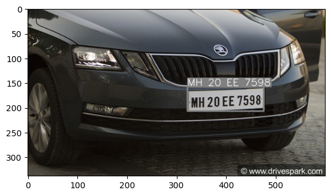
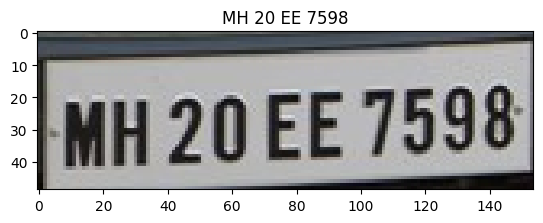

# ALPR using YOLOV8

> a simple notebook (not yet Implemented!) that detect bounding box *(xywh)* of licence plate using fine tuned `YOLOV8` using a roboflow dataset.

> and detect text in that region using `easyocr`.

> then `easyocr` will read it.

